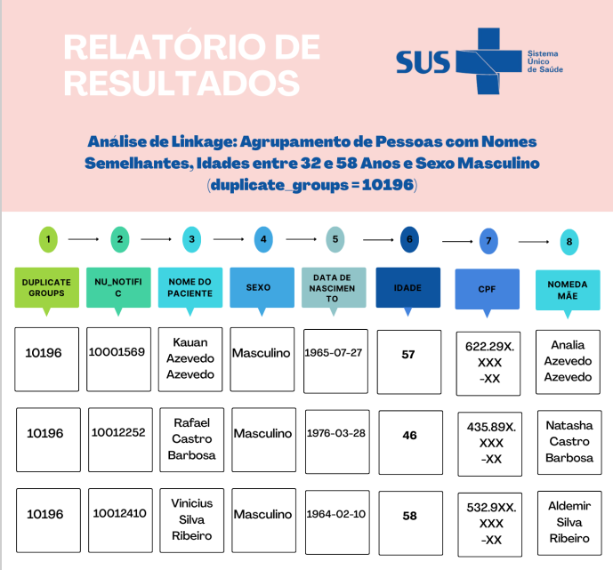

# Linkage_Data_Health

<div align="center">
  <br>
</div>


Este repositório apresenta uma abordagem prática para a vinculação de registros (record linkage) utilizando a linguagem R, com foco na integração de bases de dados no contexto da vigilância em saúde.


```

linkage-vigilancia-saude/
├── data/
│   ├── base1.csv
│   └── base2.csv
├── scripts/
│   ├── 01_preprocessamento.R
│   ├── 02_linkage_deterministico.R
│   ├── 03_linkage_probabilistico.R
│   └── 04_analise_resultados.R
├── resultados/
│   └── relatorio_linkage.pdf
├── README.md
└── LICENSE


```


​O `record linkage`, também conhecido como `resolução de entidade` ou `vinculação de registros`, é uma técnica essencial na integração de bases de dados, especialmente no campo da saúde pública. Consiste em identificar e combinar registros que se referem ao mesmo indivíduo, mesmo quando dispersos em diferentes sistemas de informação ou quando há duplicidade dentro de uma única base.​

Na vigilância em saúde, o record linkage permite a construção de conjuntos de dados mais completos, facilitando análises aprofundadas sobre agravos, doenças e casos específicos. Por exemplo, é possível relacionar dados do Sistema de Informações sobre Nascidos Vivos (SINASC) com os do Sistema de Informação sobre Mortalidade (SIM) para estudar a mortalidade infantil, ou cruzar informações do Sistema de Informação da Vigilância Epidemiológica da Gripe (SIVEP-Gripe) com o Sistema de Informações do Programa Nacional de Imunizações (SI-PNI) para avaliar a eficácia vacinal.​

Entretanto, a aplicação do record linkage enfrenta desafios, como inconsistências nos dados, ausência de identificadores únicos e erros de digitação. Para superar essas dificuldades, são utilizados métodos determinísticos, probabilísticos e híbridos, que consideram múltiplos campos de identificação e aplicam algoritmos específicos para aumentar a precisão das correspondências.​

A utilização de ferramentas como a linguagem de programação R tem se mostrado eficaz na implementação dessas técnicas, permitindo a automação e a escalabilidade dos processos de vinculação. Assim, o record linkage se estabelece como uma ferramenta fundamental para aprimorar a qualidade dos dados e subsidiar decisões informadas na área da saúde pública.

# 1.1 Sensibilidade e especificidade.

Ao planejar a realização de um record linkage, é fundamental compreender os vieses e as características das bases de dados envolvidas, pois esses fatores influenciam diretamente na escolha do método de pareamento mais adequado. Não existe um método universalmente superior; a seleção deve considerar a natureza dos dados, os objetivos da análise e as limitações técnicas e computacionais.​

Desde os primeiros estudos na década de 1960, diversos métodos e softwares foram desenvolvidos para facilitar o pareamento de registros entre bases distintas. Entretanto, a qualidade e a confiabilidade dos dados, a presença de informações faltantes e erros de digitação representam desafios significativos, podendo comprometer a acurácia do linkage. Assim, é essencial avaliar a completude dos registros, a estrutura das bases e a capacidade computacional disponível.​

A avaliação do desempenho dos métodos de linkage pode ser realizada por meio de métricas como sensibilidade e especificidade, que ajudam a quantificar a precisão das correspondências estabelecidas. Essas métricas são fundamentais para validar os resultados e garantir a integridade das análises subsequentes.


<div align="center">
  <br>
</div>

<BR> 

O processo de "linkage" (ou correspondência de registros) é frequentemente baseado em comparações aproximadas, nas quais são atribuídos pesos diferentes a cada campo (variável) com base em seu poder de discriminação e susceptibilidade a erros. Exemplos de campos com diferentes pesos incluem `nome`, `data de nascimento` e `nome da mãe`.

Para melhorar os resultados do linkage, são desenvolvidas rotinas computacionais específicas para cada problema, que serão exploradas ao longo do curso. Um aspecto importante desse processo é avaliar a acurácia das técnicas usadas para relacionar as bases de dados, utilizando duas métricas principais:

1. **Sensibilidade**: Refere-se à capacidade de um método de identificar corretamente correspondências verdadeiras entre dois registros (verdadeiros positivos).

2.  **Especificidade**: Relaciona-se à capacidade de discriminar corretamente registros que não devem ser considerados correspondentes (verdadeiros negativos).

Embora idealmente queiramos que os métodos de linkage tenham 100% de sensibilidade e especificidade, é comum que haja `falsos positivos` (quando registros não correspondem, mas são erroneamente considerados como correspondentes) e `falsos negativos` (quando registros que deveriam ser correspondentes não são identificados como tal).

# 2. Recursos preparatórios para fazer um linkage

O método de blocagem, algoritmos fonéticos como o Soundex e técnicas de otimização de linkage são ferramentas importantes para melhorar a acurácia no relacionamento entre bancos de dados e garantir que registros semelhantes sejam corretamente identificados como correspondentes, mesmo que haja variações na forma como os dados são registrados.


<div align="center">
  <br>
</div>

<BR> 

# 2.1 Blocking 

A `blocagem` é uma técnica de pré-processamento usada para reduzir o número de comparações necessárias entre registros durante o processo de linkage. Em vez de comparar todos os registros de uma base de dados com todos os registros da outra base (o que pode ser muito ineficiente), a blocagem divide os registros em grupos ou "blocos" com base em características comuns (como uma parte do nome ou um prefixo de data). Dessa forma, os registros dentro de cada bloco são mais semelhantes entre si, e somente os registros dentro do mesmo bloco são comparados.

Por exemplo, se você tem um banco de dados com nomes de pessoas, pode usar a primeira letra do nome para dividir os registros em blocos (A, B, C, etc.). Isso reduz o número de comparações que precisam ser feitas e, consequentemente, aumenta a eficiência do processo de linkage.


# 2.2 Algoritmos Fonéticos (como o Soundex)


Os algoritmos fonéticos são usados para comparar palavras que soam de forma semelhante, mas que podem ser escritas de maneiras diferentes. Eles são úteis quando se lida com registros que podem ter erros de digitação ou variações de grafia, como nomes que podem ser escritos de várias formas, mas soam semelhantes.

Um exemplo famoso de algoritmo fonético é o Soundex. O Soundex transforma palavras em códigos numéricos com base em como elas soam, considerando as consoantes e simplificando as variações de grafia. Por exemplo, "Smith" e "Smythe" podem ser mapeados para o mesmo código Soundex, ajudando a identificá-los como correspondentes, mesmo que a escrita seja diferente.

Existem outros algoritmos fonéticos além do Soundex, como o Metaphone e o Double Metaphone, que são mais sofisticados e podem lidar com uma gama maior de variações fonéticas.


# 2.2.1 Soundex

O soundex é o algoritmo que transforma cada palavra em um código de formato específico, formado por uma letra e três números. A primeira letra será sempre a primeira letra da palavra e os códigos numéricos, por sua vez, representam letras que possuem pronúncias semelhantes.

As regras para conversão de um soundex seguem as seguintes etapas a seguir:

*   A- Manter a primeira letra.
*   B- Para as letras seguintes, ignoram-se todas as vogais, assim como as letras `y`, `h` e `w`.
*  C-  E as consoantes remanescentes são convertidas de acordo com a Tabela 2.

<div align="center">
  <br>
</div>

<BR> 

*   D- Letras com o mesmo código adjacente ou separadas apenas por y, h e w são codificadas em apenas um número.
*   E- Se ao final da conversão existirem três ou mais números, o código 0 é adicionado até que se atinja três números. Caso exista um número maior do que três, apenas os três primeiros números são mantidos.

<div align="center">
  <br>
</div>

<BR>


# 3. Tipos de linkage

O pareamento de bases de dados, especialmente na área da saúde, é um processo desafiador, principalmente devido à ausência de um identificador único e confiável. Isso dificulta a identificação direta de registros referentes ao mesmo indivíduo entre diferentes bases de dados, mesmo quando há identificadores disponíveis.

Para lidar com esse desafio, o `R` será uma ferramenta essencial na construção de rotinas de linkage de dados. Serão explorados diferentes métodos de relacionamento entre registros:

*   `Determinístico`: baseia-se em regras fixas e exatas (como igualdade de `CPF` ou `nome completo`).

*   `Probabilístico`: utiliza a combinação de variáveis e atribui pesos diferentes, considerando a possibilidade de erros e variações nos dados.

*   `Híbrido`: combina aspectos dos dois métodos anteriores para aproveitar o melhor de cada abordagem.

O método mais adequado para cada tipo de análise, utilizando algoritmos de linkage mais sofisticados, capazes de lidar com incertezas e melhorar a qualidade das correspondências.

# 3.1 Linkage determinístico

O linkage determinístico é um método de pareamento baseado na correspondência exata entre registros de dois bancos de dados. Ele pode usar um único campo com identificador único (como `CPF`, `RG` ou `CNS`), ou uma combinação de campos como `nome`, `sobrenome` e `data de nascimento`.

Esse método é altamente eficiente quando os dados são `completos e sem erros`, pois identifica corretamente registros verdadeiros e descarta os inconsistentes. No entanto, parte do pressuposto de que os dados estão 100% corretos, sem erros de digitação, abreviações ou valores faltantes.

Quando há possibilidade de pequenas inconsistências nos dados, o linkage determinístico pode falhar. Nesses casos, métodos mais flexíveis como o `linkage probabilístico` são mais adequados.

# 3.2 Linkage probabilístico

O `linkage probabilístico` é uma técnica de correspondência de registros que leva em conta a `probabilidade` de dois registros pertencerem ao mesmo indivíduo, mesmo que não sejam idênticos. Em vez de exigir correspondência exata (como no linkage determinístico), ele compara os dados com base em `pontuações (scores)` e `pesos atribuídos` às concordâncias e discordâncias entre os campos.

Por exemplo, ao comparar dois registros semelhantes como:

*   **“Fabio Luiz Rosa”** (sem acento e sem preposição)

*   **“Fábio Luis da Rosa”** (com acento, variação na grafia e preposição)

Um linkage determinístico rejeitaria essa correspondência. Já o linkage probabilístico consideraria essas variações e avaliaria a `semelhança geral dos registros`, permitindo uma correspondência mais flexível e realista em situações com `erros de digitação, abreviações ou inconsistências menores`.

<BR>

Tabela 4: Exemplos de incosistências comuns encontradas na variável  `nome `. 

| Divergência  | Nome original                | Resultado |
| ------  | :-----------------------: | :--------: | 
| Exclusão de letras duplas  | CAMILLA | CAMILA| 
| Inversão de duas letras consecutivas  | LAURA | LUARA| 
| Exclusão de uma letra do fim | DAVID | DAVI|
| Inserção de uma letra do fim | SARA | SARAH|
| Exclusão de um letra do meio | JOSUÉ | JOSÉ|
| Substituição de um letra no meio | ISABEL| IZABEL|
| Inserção de uma letra do meio | MATEUS | MATHEUS|
| Inserção de uma letra no inicio | ENRIQUE | HENRIQUE |
| Substituição da primeira letra | VALDIR | WALDIR|
| Substituição de mais de uma letra | SOPHIA| SOFIA|

<BR>

Não é apenas em textos ou nomes, as inconsistências também podem ocorrer em dados com valores numéricos (substituição de caracteres em `CPFs`, `RGs` e `CNSs`) ou até mesmo em datas (mudança na ordem entre `mês` e `dia`, digitação incorreta de um ou mais valor da data).

Já em uma comparação probabilística, um índice seria atribuído à essas correspondências, indicando uma alta probabilidade de se referirem à mesma pessoa. Observe a seguir o detalhamento de duas das métricas comumente empregadas em comparações probabilísticas: a `distância de Hamming` e a `distância de Levenshtein`

Algoritmos baseados em distancia: 

*   `A distância de Hamming`
Este índice compara duas sequências de caracteres de mesmo comprimento e calcula o número de elementos que diferem entre si. Em outras palavras, ela mede o menor número de substituições necessárias para transformar uma sequência de caracteres em outra.

| STRING 1  | STRING 2               | HAMMING |
| ------  | :-----------------------: | :--------: | 
| SAÚDE  | SAÚDE | 0|
| VALOR  | MENOR | 2|
| VALOR  | MUITO | 5|
| 27/07/2020  | 27/07/2021 | 1|
| 12/03/2022  | 12/03/1997 | 4|

*   `A distância de Levenshtein``

Este índice é uma forma mais ampla da distância de Hamming e permite comparar sequências de caracteres de diferentes tamanhos. Além de substituições, outras “transformações” incluem a inserção ou exclusão de caracteres.


### 4. Preparando sua base de dados para fazer o linkage

O processo de relacionamento de bases de dados segue um conjunto de boas práticas para otimizar a acurácia do linkage. Os principais passos são:

1. **Padronização dos campos**: Consiste em tratar variáveis comuns, como separar componentes do nome e transformar caracteres para caixa alta, mantendo os valores ausentes (NA) para serem considerados na métrica de similaridade.

2. **Identificação da variável de blocagem**: Escolher uma variável que ajude a minimizar o custo do processamento e a perda de pares verdadeiros, garantindo um agrupamento eficiente dos registros.

3. **Escolha do método de linkage**: Utiliza-se a cálculo de escores para medir a similaridade entre registros de um par, avaliando o grau de concordância global.

4. **Definição de limiares**: Estabelece-se um limite para classificar os pares em "verdadeiros", "não pares" e "duvidosos", com base na similaridade observada.

5. **Revisão manual dos pares duvidosos**: Em casos necessários, realiza-se uma revisão manual dos pares duvidosos para classificá-los corretamente. Embora não seja sempre possível, essa revisão pode validar a precisão do linkage nas primeiras tentativas.

Esses passos, adaptados de Coeli & Camargo Jr (https://doi.org/10.1590/S1415-790X2002000200006), visam garantir um processo eficiente e preciso no relacionamento de dados.

### 4.1 Deduplicando da base de dados

O primeiro passo do processo de linkage é a deduplicação, que consiste em identificar e remover registros duplicados nas bases de dados. Esse processo nem sempre pode ser automatizado, pois duplicatas podem conter informações complementares. Por isso, é fundamental identificar os registros de melhor qualidade e, quando necessário, realizar uma verificação manual para consolidar os dados em um único registro mais completo e preciso.

| NOME PACIENTE  | DATA DE INTERNAÇÃO               | EVOLUÇÃO |
| ------  | :-----------------------: | :--------: | 
| JOSE DA SILVA  |  | CURA|
| JOSE DA SILVA  | 21/10/2018 | |

<BR>
#

O `R` oferece diversos pacotes para realizar  `linkage de registros `. Neste curso, foi escolhido o pacote reclin por sua simplicidade e adequação à demonstração dos principais conceitos do processo. Outros pacotes relevantes incluem:

*   `RecordLinkage`: Funções para ligação e deduplicação de dados.

*    `reclin2 `: Versão mais recente do reclin, com diferenças na implementação.

*    `diyar `: Focado em linkage e definições epidemiológicas.

*    `BRL `: Metodologia Beta Record Linkage.

*    `fastLink `: Linkage probabilístico rápido com dados faltantes.

*    `PPRL `: Linkage com preservação de privacidade.

Importante: o termo linkage pode ter diferentes significados em áreas como estatística, genética e teoria dos grafos.
#

Script a seguir para instalar e carregar os pacotes tidyverse, reclin e outros. 


```r
if(!require(tidyverse)) install.packages("tidyverse");library(tidyverse)
if(!require(reclin)) install.packages("reclin");library(reclin)
if(!require(digest)) install.packages("digest");library(digest)
if(!require(knitr)) install.packages("knitr");library(knitr)
if(!require(DT)) install.packages("DT");library(DT)

```